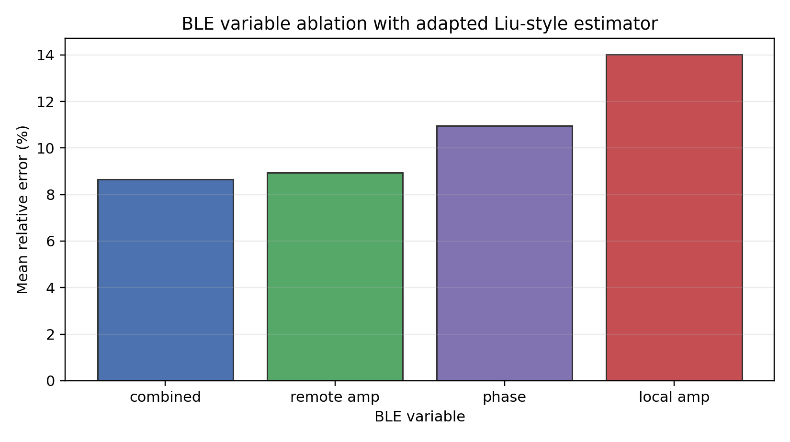
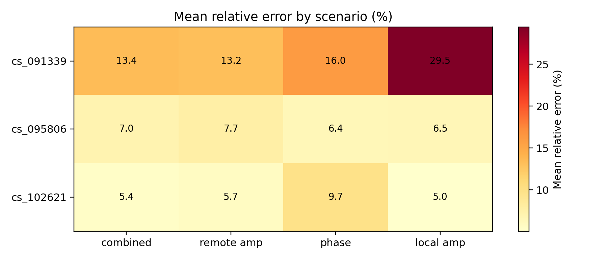
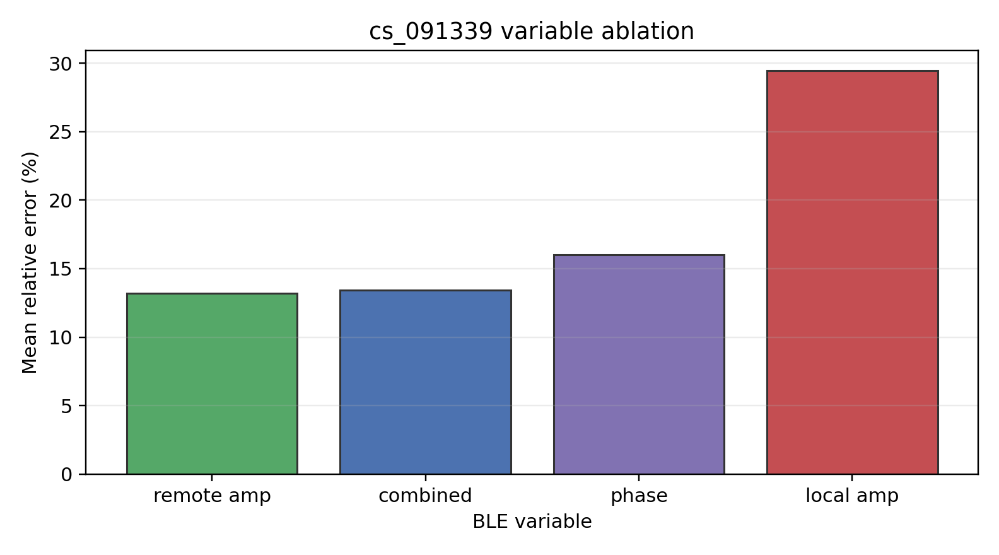
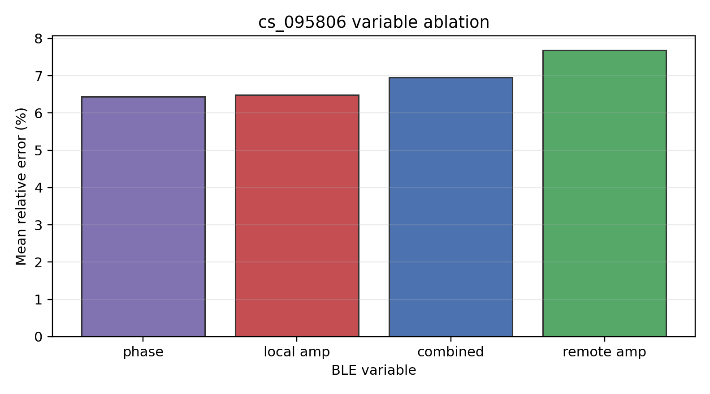
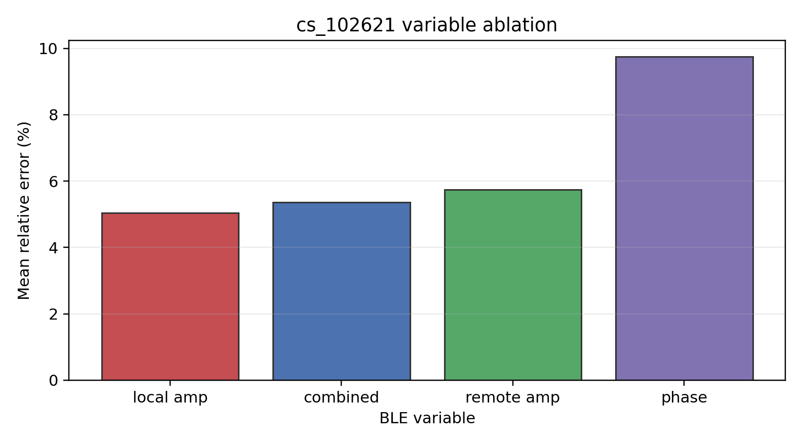

# Liu 2016 BLE 历史变量消融报告

## 当前定位

本报告是历史 exploratory ablation，用来记录早期对 `remote_amplitudes`、`local_amplitudes`、`phases` 和 `combined` 的 BLE 变量对比。它不再作为项目最终结论，也不再用于说明“哪个变量最好”。

现在项目主线已经调整为：

```text
Stage 1：单变量信息能力分析
Stage 2：多变量融合方法比较
```

因此，本报告的作用是说明：早期变量消融观察到不同变量在不同场景中表现会变化，这提示 BLE CS 存在多变量互补性，进而引出 `multivariable_fusion` 研究。

严格 Liu 2016 原文复现见：

- [liu_2016_report.md](</Users/shenmeichen/26 X program/ble_hci_sensing-main/docs/reports/liu_2016_report.md>)
- [liu_2016_results_report.md](</Users/shenmeichen/26 X program/ble_hci_sensing-main/docs/reports/liu_2016_results_report.md>)

新的多变量融合研究见：

- [multivariable_fusion_plan_report.md](</Users/shenmeichen/26 X program/ble_hci_sensing-main/docs/reports/multivariable_fusion_plan_report.md>)
- [stage1_variable_information_report.md](</Users/shenmeichen/26 X program/ble_hci_sensing-main/docs/reports/stage1_variable_information_report.md>)
- [stage2_multivariable_fusion_report.md](</Users/shenmeichen/26 X program/ble_hci_sensing-main/docs/reports/stage2_multivariable_fusion_report.md>)

## 数据来源

历史结果来自：

```bash
PYTHONPATH=src python notebooks/scripts/chFusion_liu_2016_modal_comparison.py --all
```

主要 CSV：

- `outputs/reports/liu_2016_cs_091339_modal_comparison.csv`
- `outputs/reports/liu_2016_cs_095806_modal_comparison.csv`
- `outputs/reports/liu_2016_cs_102621_modal_comparison.csv`
- `outputs/reports/liu_2016_cross_scenario_modal_summary.csv`

整理后的图：











## 图表解读

### 图 1：历史跨变量平均误差


这张图曾经容易被理解成“变量排名”。现在应把它解释为：早期 `combined` 结果显示多个 BLE 变量一起使用有潜在收益，因此值得进入新的 fusion study。它不能被写成 strict Liu reproduction 的结论，也不能直接作为最终变量选择依据。

### 图 2：场景 × 变量热图


这张图更适合支撑“互补性”结论。不同场景下低误差变量并不固定，说明变量可靠性随场景变化。这个现象比单个平均排名更重要，因为它说明固定选择一个变量可能会在某些场景失效。

### 图 3-5：分场景变量消融


`cs_091339` 中 `remote_amplitudes` 与 `combined` 更接近，`local_amplitudes` 明显偏弱。这说明 local branch 在某些采集条件下可能不可靠。


`cs_095806` 中 `phases` 和 `local_amplitudes` 也能取得较低误差，说明 phase 不应因为全局平均不占优而被直接排除。


`cs_102621` 中 `local_amplitudes` 和 `combined` 表现较好，进一步说明变量稳定性具有场景依赖。这个现象正是 Stage 2 adaptive selection 和 variable-level fusion 的动机。

## 历史观察

| 变量 | 历史跨场景平均相对误差 | 现在的解释 |
|---|---:|---|
| `combined (remote+local+phases)` | 8.66% | 多变量组合在早期 adapted baseline 中有收益，支持后续融合研究 |
| `remote_amplitudes` | 8.93% | 单变量中曾表现稳定，但不能作为最终唯一变量结论 |
| `phases` | 10.95% | 部分场景有效，说明 phase 可能提供互补信息 |
| `local_amplitudes` | 14.02% | 场景敏感，但在部分场景中也可能有效 |

这些数值只保留为历史记录。由于该实验使用的是 BLE adapted pipeline，不是 strict Liu 2016 reproduction，也不是新的融合研究主流程，所以不应继续写成最终排名。

## 分场景互补性

| 场景 | 历史低误差变量 | 观察 |
|---|---|---|
| `cs_091339` | `remote_amplitudes` / `combined` | remote 更稳，local 失效较明显 |
| `cs_095806` | `phases` / `local_amplitudes` | phase 和 local 均有可用信息 |
| `cs_102621` | `local_amplitudes` / `combined` | local 在该场景中有效，phase 波动较大 |

这说明单变量表现不是固定的。更合理的研究问题不是“哪个变量全局最好”，而是“如何在窗口级动态利用不同变量的信息”。

换句话说，历史 ablation 的价值不是证明 `combined` 一定最好，而是证明变量之间存在互补关系。新的 `multivariable_fusion` 报告会进一步把这种互补性拆解为 tone-level 和 variable-level 两个层级。

## 与新研究的关系

早期 `combined` 结果说明简单组合可能有效，但它没有清楚区分：

- tone/channel-level fusion；
- variable-level fusion；
- 质量权重来源；
- adaptive selection 与 weighted combining 的差异。

因此，新版 `multivariable_fusion` 将问题拆成两个层级：

1. 同一种变量内部多个 tone 如何融合；
2. local / remote / phase 三个变量之间如何融合。

这个结构比历史四变量排名更适合作为论文和导师汇报的主线。

## 结论

本报告只作为历史 exploratory ablation 存档。最终报告中应弱化“变量排名”叙述，改为：

> 历史 BLE 变量消融显示不同变量在不同场景中存在互补性，因此后续研究转向多层级融合方法比较。
