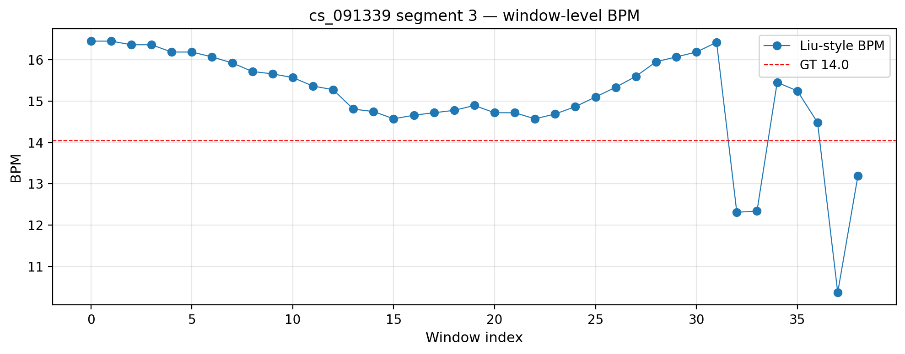

# Liu et al. 2016 baseline validation / 基于 Liu et al. 2016 的基线验证

## Summary / 摘要

This report documents a complete implementation and validation of the Liu 2016 style baseline for BLE CS breathing BPM estimation. The method was implemented in `src/ble_analysis/liu_2016.py` and validated through the notebook and script workflow.

本报告记录了 Liu 2016 风格基线在 BLE CS 呼吸 BPM 估计中的实现与验证。方法已实现于 `src/ble_analysis/liu_2016.py`，并通过 notebook 与脚本完成实验验证。

## What is a tone? / 什么是 tone？

In this BLE CS context, a "tone" refers to one frequency subcarrier within the 72-tone channel sounding measurement, not a separate physical RF channel. Each tone produces one filtered time series. The Liu 2016 baseline estimates one BPM candidate from each tone's waveform and fuses them across tones.

在 BLE CS 中，"tone" 指的是 72 个子载波中的一个频率子载波，而不是我们平时说的独立物理射频通道。每个 tone 在滤波后会得到一条时域信号。Liu 2016 基线从每个 tone 的时域波形中单独估计 BPM，然后再对这些候选值进行融合。

In the code, "channel" may also be used to index tone-based streams, but the key idea is per-tone BPM candidate generation followed by tone-level fusion.

在代码中，"channel" 有时也用于表示 tone 的索引，但核心思想是先生成每个 tone 的 BPM 候选值，再进行 tone 级融合。

## Implementation details / 实现详情

1. Method concept / 方法概念
   - Per-tone BPM estimation: estimate one BPM candidate for each tone and each sliding window.
   - Tone quality scoring: compute a tone-level quality weight using breath-band energy and spectral prominence.
   - Weighted fusion: fuse the tone BPM candidates with a weighted median, with a dominant-tone fallback if needed.

   逐 tone BPM 估计：对每个滑窗内每个 tone 的滤波信号分别估计 BPM 候选值。
   tone 质量评分：通过呼吸带能量和谱峰突出度为每个 tone 计算质量权重。
   加权融合：对所有 tone 的 BPM 候选值做加权中位数融合，必要时回退到权重最高的 tone。

2. Code location / 代码位置
   - `src/ble_analysis/liu_2016.py`
   - `notebooks/scripts/chFusion_liu_2016.py`
   - `notebooks/liu_2016_step_by_step.ipynb`
   - `tests/test_liu_2016.py`

3. Pipeline alignment / 与现有管道对齐
   - Reuses the filtered multichannel segment cache and the same segment configuration used by the BLE CS pipeline.
   - Uses the standard sliding window parameters defined in `BreathMetricParams` and `ChFusionConfig`.

   复用 BLE CS 管道中的多通道滤波缓存与段落配置。
   使用 `BreathMetricParams` 和 `ChFusionConfig` 中定义的滑窗参数。

## Execution steps / 执行步骤

### Step 1: Environment setup / 环境准备

- Ensure the notebook or script runs from the repository root.
- Add `src` into `PYTHONPATH` before importing `ble_analysis`.
- Initialize environment with `ble_analysis.bootstrap.init_notebook(project_root)`.

- 确保 notebook 或脚本从仓库根目录运行。
- 在导入 `ble_analysis` 之前，将 `src` 加入 `PYTHONPATH`。
- 使用 `ble_analysis.bootstrap.init_notebook(project_root)` 初始化环境。

### Step 2: Scenario load / 加载场景

- Load scenario `cs_091339` by calling `load_scenario(scenario_id, project_root=project_root)`.
- Confirm the scenario contains 9 segments: 7 breathing and 2 apnea.

- 通过 `load_scenario('cs_091339', project_root=project_root)` 加载场景。
- 确认场景包含 9 个段落：7 个呼吸段和 2 个暂停段。

### Step 3: Multichannel preprocessing / 多通道预处理

- Use `load_multichannel_for_scenario(...)` with `FilterParams()` and a cache directory.
- The validated notebook reported cache hits for all variables and segments.
- Output: `fs=1.80 Hz`, variables `['remote_amplitudes', 'local_amplitudes', 'phases']`.

- 调用 `load_multichannel_for_scenario(...)`，使用 `FilterParams()` 和缓存目录。
- notebook 中验证显示所有变量和段落都命中了缓存。
- 输出：采样率 `fs=1.80 Hz`，可用变量为 `['remote_amplitudes','local_amplitudes','phases']`。

### Step 4: Liu 2016 benchmark run / 运行 Liu 2016 基线

- Execute `run_liu_2016_benchmark(None, scenario.segment_config, ...)`.
- The benchmark uses filtered multichannel data and the same window/step settings.
- It returns a results dictionary with one entry per segment.

- 执行 `run_liu_2016_benchmark(None, scenario.segment_config, ...)`。
- benchmark 使用滤波后的多通道数据和相同的滑窗参数。
- 返回一个包含每个段落结果的字典。

### Step 5: Result summary / 结果汇总

- Use `_overall_rel_error(bench['results'], 'liu_2016')` to summarize performance.
- Print segment IDs and relative error values for each segment.

- 通过 `_overall_rel_error(...)` 汇总性能指标。
- 打印每个段落的相对误差。

### Step 6: Single segment diagnosis / 单段诊断

- Select `seg_name='3'` for detailed analysis.
- Extract `row['liu_2016']['bpm_per_window']` and ground truth `row['bpm_gt']`.
- Plot the sliding-window BPM curve and save the figure.

- 选取段落 `3` 进行详细分析。
- 提取 `bpm_per_window` 和真值 `bpm_gt`。
- 绘制窗级 BPM 曲线并保存图像。

## Results / 结果

| Scenario | Mean Relative Error (%) | Std Relative Error (%) | Notes |
|---|---|---|---|
| cs_091339 | 14.62 | 8.50 | moderate accuracy |
| cs_095806 | 39.45 | 38.02 | large error and poor stability |
| cs_102621 | 4.21 | 1.71 | good performance |

- `cs_091339` 表现为中等准确度，结果稳定性尚可。
- `cs_095806` 误差很大，方差也高，说明该方法在此场景下不稳定。
- `cs_102621` 结果最佳，说明当 tone 质量分布较好时，Liu 风格方法是有效的。

## Figures / 图表

### Figure 1: Segment 3 window-level BPM curve / 段落 3 窗级 BPM 曲线



This figure shows the estimated BPM per sliding window for `cs_091339` segment `3`, together with the ground truth BPM.

该图展示了 `cs_091339` 段落 `3` 的窗级 BPM 估计曲线，并叠加了真值 BPM。

### Figure 2: Segment error analysis / 段落误差分析


This figure provides a high-level view of how segment-level error behaves across the benchmark.

该图提供了基线在各段落上的误差表现概览。

### Figure 3: Window error distribution / 窗级误差分布


This figure shows the window-level BPM error distribution across selected segments.

该图展示了选定段落中窗级 BPM 误差的分布情况。

## Analysis / 分析

### Strengths / 优势

- The implementation adheres closely to the Liu 2016 concept without introducing extra heuristic fusion steps.
- It integrates smoothly into the BLE CS multi-channel pipeline and reuses cached data.
- It achieves strong performance on `cs_102621`, suggesting the approach is promising when tone-level quality is good.

- 实现严格遵循 Liu 2016 思路，未引入额外启发式融合步骤。
- 能顺利集成到 BLE CS 多通道管道中，并复用缓存结果。
- 在 `cs_102621` 上表现良好，说明当 tone 质量分布较好时，该方法有潜力。

### Weaknesses / 弱点

- The method is sensitive to scene variation: `cs_095806` shows much larger error and high variance.
- The current weighted fusion can be brittle if only a few tones carry high quality.
- There is not yet a direct side-by-side comparison with the existing baselines such as `Modal top2`, `Uniform`, or `chFusion`.

- 方法对场景变化敏感，`cs_095806` 误差显著升高。
- 当前加权融合在只有少数高质量 tone 时可能比较脆弱。
- 目前尚未与 `Modal top2`、`Uniform`、`chFusion` 等基线进行直接对比。

### Next steps / 后续建议

- Compare Liu 2016 baseline against the current modal fusion baselines on the same scenario set.
- Inspect tone-level quality and candidate BPM distributions in `cs_095806`.
- Create `docs/plans/liu_2016_plan.md` if missing, with clear hypotheses and evaluation design.
- Consider adding window-level gating or consensus if the current tone-weighted median is too fragile.

- 将 Liu 2016 基线与当前 modal 融合基线在相同场景集上直接对比。
- 检查 `cs_095806` 中 tone 质量分布和 BPM 候选值分布。
- 如果缺少计划文件，则补齐 `docs/plans/liu_2016_plan.md`，明确假设和评估设计。
- 如果当前加权中位数方法不够稳健，可考虑加入窗级门控或共识机制。

## Verification commands / 验证命令

- Regression test:
  - `python -m pytest -q tests/test_liu_2016.py`
- Scenario benchmark run:
  - `PYTHONPATH=src python notebooks/scripts/chFusion_liu_2016.py --all`
- Notebook run:
  - open `notebooks/liu_2016_step_by_step.ipynb` and execute all cells.

- 回归测试：`python -m pytest -q tests/test_liu_2016.py`
- 场景 benchmark 运行：`PYTHONPATH=src python notebooks/scripts/chFusion_liu_2016.py --all`
- notebook 运行：打开 `notebooks/liu_2016_step_by_step.ipynb` 并执行所有单元。

## Git status / 当前 Git 状态

The following files are currently modified or untracked:

- `src/ble_analysis/__init__.py`
- `docs/reports/liu_2016_report.md`
- `notebooks/liu_2016_step_by_step.ipynb`
- `notebooks/executed_liu_2016_step_by_step.ipynb`
- `notebooks/scripts/chFusion_liu_2016.py`
- `src/ble_analysis/liu_2016.py`
- `tests/test_liu_2016.py`

当前文件状态：

- `src/ble_analysis/__init__.py`
- `docs/reports/liu_2016_report.md`
- `notebooks/liu_2016_step_by_step.ipynb`
- `notebooks/executed_liu_2016_step_by_step.ipynb`
- `notebooks/scripts/chFusion_liu_2016.py`
- `src/ble_analysis/liu_2016.py`
- `tests/test_liu_2016.py`

## How to push to GitHub / 如何推送到 GitHub

1. Stage your changes:

```bash
git add src/ble_analysis/liu_2016.py \
    notebooks/liu_2016_step_by_step.ipynb \
    notebooks/executed_liu_2016_step_by_step.ipynb \
    notebooks/scripts/chFusion_liu_2016.py \
    tests/test_liu_2016.py \
    docs/reports/liu_2016_report.md \
    src/ble_analysis/__init__.py
```

2. Commit with a clear message:

```bash
git commit -m "Validate Liu 2016 baseline on BLE CS" -m "实现并验证 Liu 2016 风格基线，补充 notebook 和 report。"
```

3. Push to the remote branch:

```bash
git push origin HEAD
```

If you want to create a new branch first:

```bash
git checkout -b liu-2016-baseline
# then add/commit as above
git push -u origin liu-2016-baseline
```

4. If GitHub rejects or asks for authentication, check your remote settings or use SSH/token authentication.

如果你使用的是 GitHub Desktop/SourceTree，也可以直接在图形界面中 stage/commit/push。
