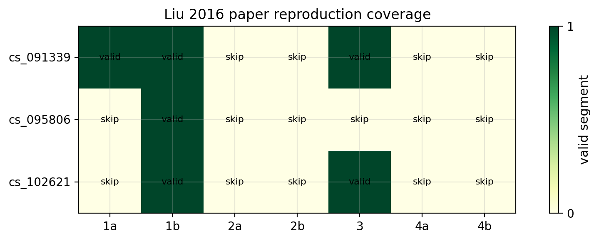
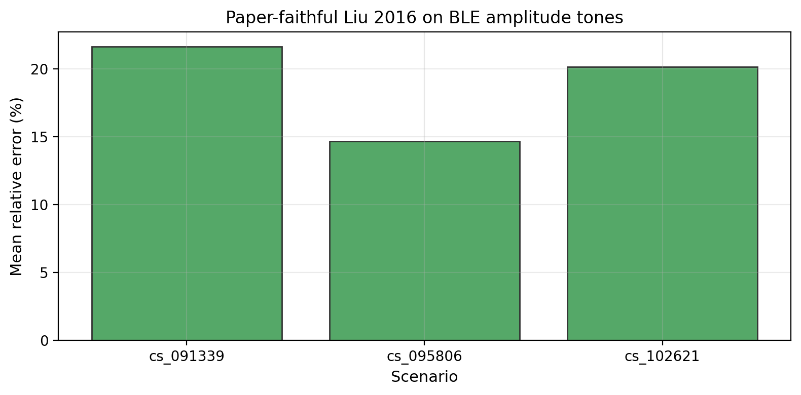
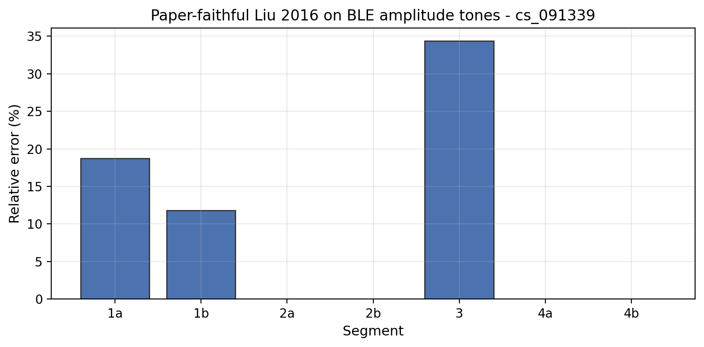
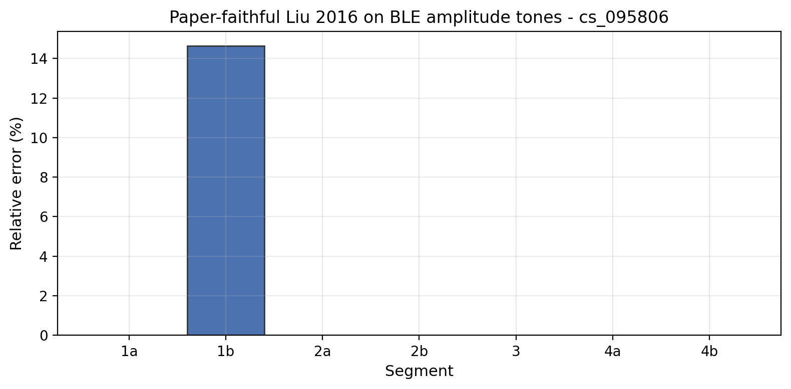
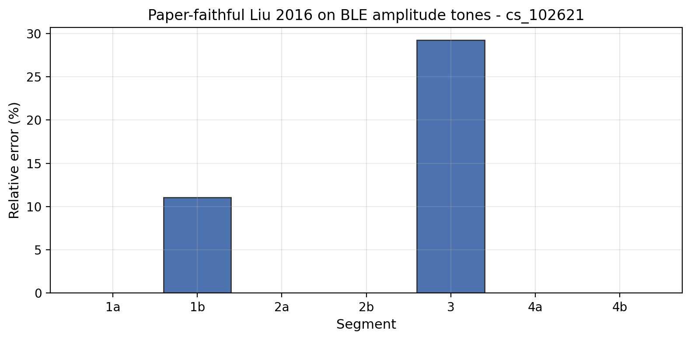
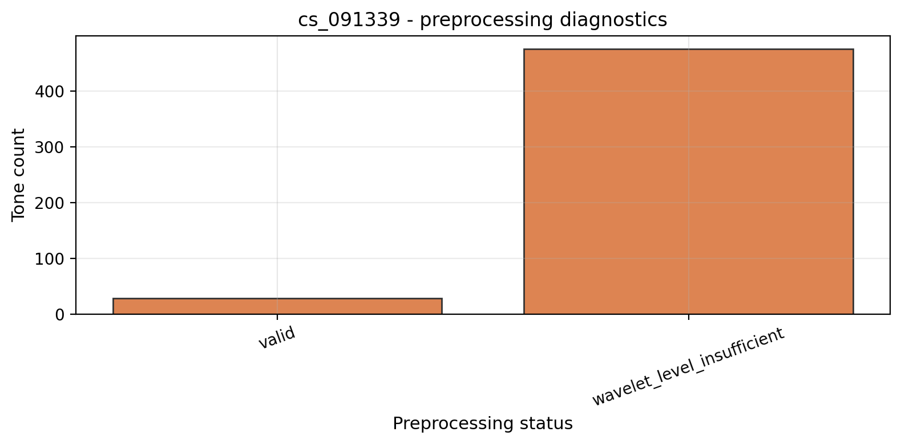
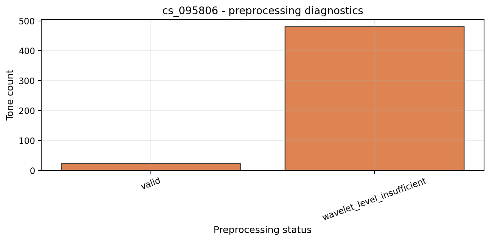

# Liu 2016 严格复现实验结果报告

## 结果摘要

本次结果来自：

```bash
PYTHONPATH=src .venv/bin/python notebooks/scripts/chFusion_liu_2016_paper.py --all
```

严格复现方法为 `liu_2016_paper`，主输入变量为原始 BLE `amplitudes`。三个场景共 21 个呼吸段，其中 6 个段产生有效的严格复现结果，有效段跨场景平均相对误差为 **19.97%**。

无效段的主要原因是 `no_valid_preprocessed_tones`。进一步看诊断表，根源通常是 BLE 低采样率下，完整段落内逐频点样本数不足以支持 Liu 原文要求的 `db4` level 4 小波分解；代码没有静默降低小波层数，所以这些段被显式跳过。

## 分场景结果

| 场景 | 有效段数 | 平均相对误差 | 说明 |
|---|---:|---:|---|
| `cs_091339` | 3/7 | 21.63% | 可计算段较多，但高 BPM 段误差明显。 |
| `cs_095806` | 1/7 | 14.64% | 只有 `1b` 通过严格预处理。 |
| `cs_102621` | 2/7 | 20.15% | `1b` 较稳定，`3` 段偏低明显。 |

## 段落级结果

| 场景 | 段落 | 真实 BPM | 预测 BPM | 相对误差 | 窗口数 | 保留频点数中位数 | 跳过原因 |
|---|---|---:|---:|---:|---:|---:|---|
| `cs_091339` | `1a` | 8.675 | 10.05 | 18.71% | 39 | 0.0 |  |
| `cs_091339` | `1b` | 8.675 | 9.49 | 11.82% | 39 | 1.0 |  |
| `cs_091339` | `2a` | 11.490 | 无 | 无 | 0 | 0 | no_valid_preprocessed_tones |
| `cs_091339` | `2b` | 11.490 | 无 | 无 | 0 | 0 | no_valid_preprocessed_tones |
| `cs_091339` | `3` | 14.040 | 9.21 | 34.37% | 38 | 0.0 |  |
| `cs_091339` | `4a` | 16.170 | 无 | 无 | 0 | 0 | no_valid_preprocessed_tones |
| `cs_091339` | `4b` | 16.170 | 无 | 无 | 0 | 0 | no_valid_preprocessed_tones |
| `cs_095806` | `1a` | 8.675 | 无 | 无 | 0 | 0 | no_valid_preprocessed_tones |
| `cs_095806` | `1b` | 8.675 | 9.40 | 14.64% | 39 | 1.0 |  |
| `cs_095806` | `2a` | 11.490 | 无 | 无 | 0 | 0 | no_valid_preprocessed_tones |
| `cs_095806` | `2b` | 11.490 | 无 | 无 | 0 | 0 | no_valid_preprocessed_tones |
| `cs_095806` | `3` | 14.040 | 无 | 无 | 0 | 0 | no_valid_preprocessed_tones |
| `cs_095806` | `4a` | 16.170 | 无 | 无 | 0 | 0 | no_valid_preprocessed_tones |
| `cs_095806` | `4b` | 16.170 | 无 | 无 | 0 | 0 | no_valid_preprocessed_tones |
| `cs_102621` | `1a` | 8.675 | 无 | 无 | 0 | 0 | no_valid_preprocessed_tones |
| `cs_102621` | `1b` | 8.675 | 9.22 | 11.04% | 39 | 1.0 |  |
| `cs_102621` | `2a` | 11.490 | 无 | 无 | 0 | 0 | no_valid_preprocessed_tones |
| `cs_102621` | `2b` | 11.490 | 无 | 无 | 0 | 0 | no_valid_preprocessed_tones |
| `cs_102621` | `3` | 14.040 | 9.93 | 29.25% | 39 | 2.0 |  |
| `cs_102621` | `4a` | 16.170 | 无 | 无 | 0 | 0 | no_valid_preprocessed_tones |
| `cs_102621` | `4b` | 16.170 | 无 | 无 | 0 | 0 | no_valid_preprocessed_tones |

## 图表索引

图表统一放在 `outputs/figures/liu_2016_paper/` 下：

- `liu_2016_paper_coverage_heatmap.png`：显示每个场景/段落是否产生有效严格复现结果。
- `liu_2016_paper_cross_scenario_summary.png`：有效段跨场景平均误差。
- `liu_2016_paper_{scenario}_preprocessing_status.png`：逐频点预处理状态，重点用于解释跳过原因。
- `liu_2016_paper_{scenario}_segment_errors.png`：段落级相对误差，跳过段用灰色斜线标注。
- `liu_2016_paper_{scenario}_segment_{segment}_window_diagnostics.png`：有效段的窗口级 BPM、保留频点数、`pr` 与离群比例。

### 推荐主图

**图 1：严格复现有效段覆盖情况**



**图 2：有效段跨场景平均误差**



**图 3：各场景段落级误差**







**图 4：逐频点预处理状态**






## 结果解释

这组结果首先说明的是严格 Liu 2016 流程在当前 BLE CS 数据上的可行性边界，而不是 BLE 优化算法的最好性能。Liu 2016 原始 WiFi 数据包采样率约 20 Hz，而当前 BLE 数据约 1.7-1.9 Hz。由于严格版本保留 `db4` level 4 且不做静默降级，许多段落在预处理阶段就无法产生足够的有效频点。

有效段里，低 BPM 段如 `1b` 的误差相对较小，`cs_091339/1b` 为 11.82%，`cs_102621/1b` 为 11.04%。较高 BPM 段如 `cs_091339/3` 和 `cs_102621/3` 明显被估低，误差分别为 34.37% 和 29.25%。这暗示在 BLE 低采样率和短段条件下，Liu 原文的 FFT peak ± 1 IFFT 相位斜率细化可能更容易偏向低频稳定成分。

`median_n_kept` 在部分有效段中为 0.0，不代表没有窗口有效，而是说明至少一半窗口在 modified Z-score 后没有保留足够频点；最终段落预测来自少数有效窗口。这一点应在论文复现讨论中如实说明，不能把它解释成稳定高覆盖率结果。

## 结论

`liu_2016_paper` 已经按照原文方法完成独立实现和输出整理，但在当前 BLE 数据上受到采样率和小波层数可行性的硬限制。后续若目标是提高 BLE 表现，应放在 `liu_eta_rho_adapted` 或新的 BLE 适配方法中讨论；严格复现报告中应保持原文算法边界，不混入 `η·ρ`、dominant-tone fallback 或多模态融合。
