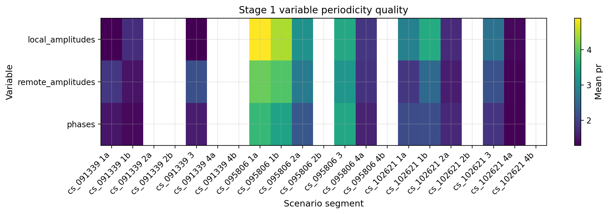
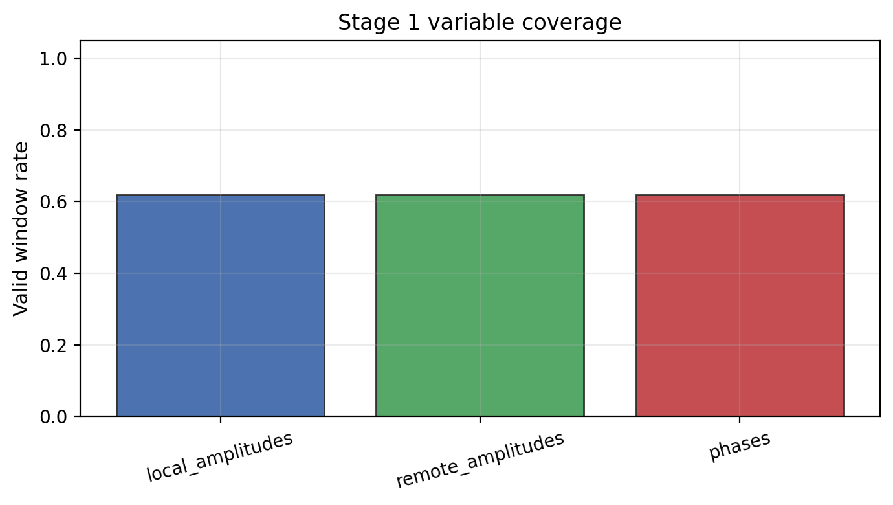
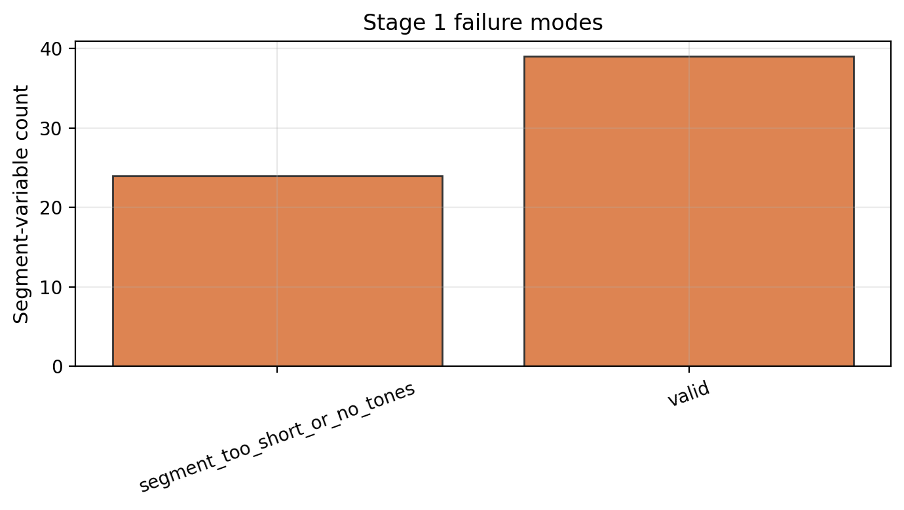

# Stage 1 单变量信息能力分析报告

## 目的

Stage 1 的目标是分析 `local_amplitudes`、`remote_amplitudes`、`phases` 分别提供什么呼吸相关信息。所有变量使用同一套窗口级估计和同一套 tone/channel fusion baseline，以便观察稳定性、有效窗口、质量指标和失效情况，为后续融合实验提供依据。

运行命令：

```bash
PYTHONPATH=src .venv/bin/python notebooks/scripts/chFusion_stage1_variable_information.py --all
```

本阶段使用的 reference pipeline 是单变量输入下的 `quality_mrc` tone fusion。选择它的原因是它能同时输出窗口级 BPM、tone 数量、有效 tone 数量、SNR、periodicity score、stability 和 outlier fraction。也就是说，Stage 1 不只是看误差，而是把每个变量的“可用性”和“质量形态”暴露出来，为 Stage 2 融合方法选择提供依据。

从实验定位上看，Stage 1 仍是单变量分析。它主要回答“每个变量有什么信息能力”，而 Stage 2 再继续回答“融合后是否更稳”。

## 输出文件

CSV：

- `outputs/reports/multivariable_fusion/stage1_variable_information_summary.csv`
- `outputs/reports/multivariable_fusion/stage1_variable_window_diagnostics.csv`

图：







## 图表解读

### 图 1：变量质量热图


这张图展示的是不同变量在不同 scenario/segment 上的 mean `pr`。`pr` 来自固定频率 sinusoid fitting 中的 `A/RMSE`，可理解为呼吸周期性强弱的一个质量指标。

这张图的读法重点是观察颜色分布是否一致。如果某个变量只在部分片段颜色较亮，说明它具有场景或姿态依赖；如果三个变量的高质量区域不完全重合，就说明它们可能存在互补性。这正是后续 variable-level fusion 的动机。

### 图 2：有效窗口覆盖率


这张图展示每个变量能产生有效窗口估计的比例。当前三个变量的平均有效窗口率都约为 0.62，说明 Stage 1 中仍存在不少短片段或无效窗口。这个现象提醒我们：只比较单变量均值是不够的，因为有效窗口覆盖率会直接影响最终系统的鲁棒性。

在 Stage 2 中，融合方法需要重点检查两个目标：第一，是否能在某个变量失效时借助其他变量补上；第二，是否能降低那些已经有效但误差很大的窗口。

### 图 3：失效模式统计


这张图用于区分失效来自数据长度、有效 tone 数不足，还是估计结果本身不可信。对于 BLE 数据来说，部分 segment 本身较短，20 秒窗口会天然减少可用窗口数量。因此，这里把无效窗口结合 segment 长度和窗口配置一起解释，而不是简单归因到某个变量本身。

## 当前汇总结果

基于 `stage1_variable_information_summary.csv`，按变量聚合后的平均相对误差为：

| 变量 | 平均相对误差 | 最大段级误差 | 平均有效窗口率 |
|---|---:|---:|---:|
| `local_amplitudes` | 12.21% | 24.33% | 0.62 |
| `remote_amplitudes` | 16.28% | 37.80% | 0.62 |
| `phases` | 17.55% | 59.54% | 0.62 |

这些数值用于说明信息能力和失效模式。由于 Stage 1 仍然是单变量输入，多变量互补融合是否能降低尾部误差，需要结合 Stage 2 的结果一起判断。

## 观察与解释

`local_amplitudes` 在当前 quality-MRC 单变量 reference 下平均误差较低，说明本地幅度中确实包含可用呼吸信息。后续可以把它作为一个较稳定的 amplitude branch 来参与融合。

`remote_amplitudes` 的平均误差高于 local，但它与 local 的失效窗口不一定完全重合。它的价值主要在于提供另一端幅度观测，适合与 local amplitude 一起作为幅度类分支进入融合。

`phases` 的段级最大误差更高，说明相位变量在当前 BLE 数据和滤波配置下更容易出现异常窗口。同时，相位在 WiFi 文献中被反复用于补充幅度信息，因此在本项目中仍然值得作为 variable-level fusion 的候选变量继续分析。

从信息能力角度看，三个变量的价值不同：

| 变量 | 当前观察 | 对融合的意义 |
|---|---|---|
| `local_amplitudes` | 平均误差较低，说明本地幅度中有较强呼吸成分 | 可作为稳定 amplitude branch 之一 |
| `remote_amplitudes` | 平均误差更高，但与 local 不是完全相同观测 | 可提供另一端幅度视角，适合与 local 做 branch fusion |
| `phases` | 尾部误差较高，但部分窗口仍可用 | 适合作为补充变量，需要更谨慎的质量估计或 adaptive selection |

因此，Stage 1 的阶段性结论是：三个变量都能提供呼吸信息，但质量分布和失效模式不同，适合进入 Stage 2 的多变量融合框架。

## 对 Stage 2 的启发

Stage 1 支持后续融合研究的原因是：

- 三个变量都能在部分窗口产生有效呼吸估计；
- 不同变量的质量指标和误差模式存在差异；
- 单变量 reference 存在较明显尾部误差；
- 因此需要研究 tone-level fusion 和 variable-level fusion 是否能提高鲁棒性。

后续汇报中我会把这一部分表述为“信息能力分析”“互补性观察”和“失效模式分析”，这样更符合当前融合研究主线。

## 与历史 ablation 的关系

历史 `liu_2016_ble_ablation_report.md` 曾经直接比较 `remote/local/phase/combined` 的误差。Stage 1 在这个基础上做了两点收紧：

1. 把变量误差排序调整为信息能力分析；
2. 增加质量指标、有效窗口和失效模式，以解释为什么后续需要融合。

因此，在给导师或师兄汇报时，可以把 Stage 1 表述为“变量信息能力分析”，并自然引出 Stage 2 的多变量融合实验。

## 小结

Stage 1 证明 BLE CS 的 local amplitude、remote amplitude 和 phase 都有呼吸相关信息，但它们的稳定性并不一致。单变量结果存在明显尾部误差和有效窗口限制，这为 Stage 2 的 channel-level fusion 与 variable-level fusion 提供了实验动机。
