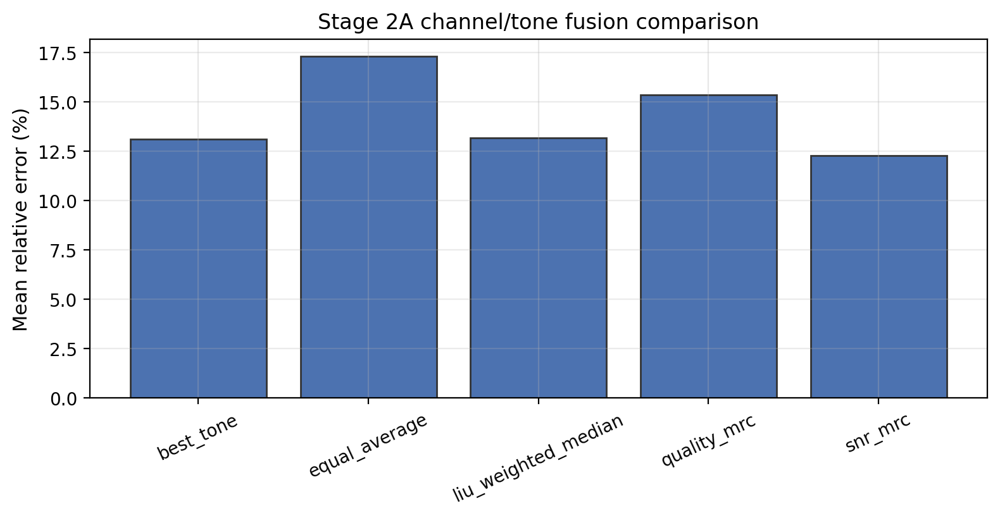
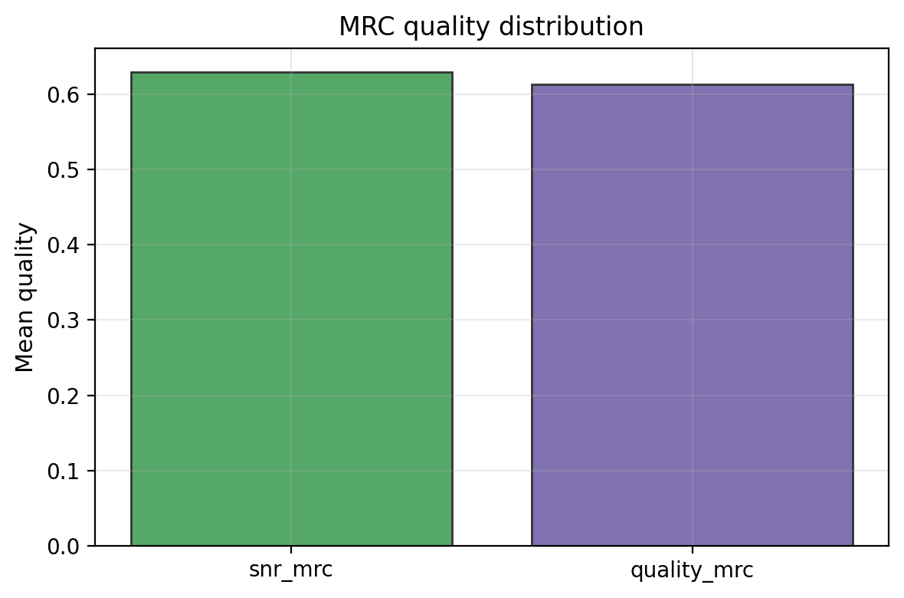
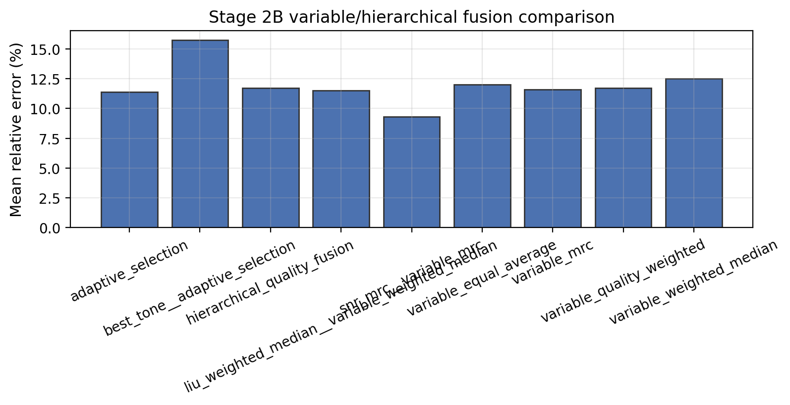
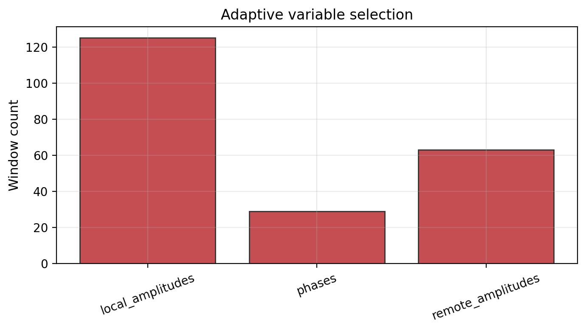

# Stage 2 多变量融合实验报告

## 目的

Stage 2 研究 BLE CS 中多层级融合是否能提升呼吸估计的鲁棒性。实验分为两层：

1. Channel / tone-level fusion：同一种变量内部多个 tone 如何融合；
2. Variable-level fusion：`local_amplitudes`、`remote_amplitudes`、`phases` 三个变量如何融合。

Stage 2 的核心评价目标有三个：

- 平均误差是否下降；
- 最大段级误差是否被压低，也就是尾部风险是否下降；
- 有效窗口覆盖率是否保持稳定。

因此，本报告不会只看“平均误差最低的方法”，还会同时解释尾部误差和方法稳定性。

运行命令：

```bash
PYTHONPATH=src .venv/bin/python notebooks/scripts/chFusion_stage2_multivariable_fusion.py --all
```

## 输出文件

CSV：

- `outputs/reports/multivariable_fusion/stage2a_channel_fusion_summary.csv`
- `outputs/reports/multivariable_fusion/stage2a_channel_fusion_windows.csv`
- `outputs/reports/multivariable_fusion/stage2b_variable_fusion_summary.csv`
- `outputs/reports/multivariable_fusion/stage2b_variable_fusion_windows.csv`

图：

- `outputs/figures/multivariable_fusion/stage2a_channel_method_comparison.png`
- `outputs/figures/multivariable_fusion/stage2a_mrc_weight_distribution.png`
- `outputs/figures/multivariable_fusion/stage2b_variable_method_comparison.png`
- `outputs/figures/multivariable_fusion/stage2b_adaptive_selection_distribution.png`

## 方法结构

Stage 2A 先在每个变量内部完成 tone/channel fusion。也就是说，`local_amplitudes`、`remote_amplitudes` 和 `phases` 各自先从多个 tone 得到一个窗口级估计。Stage 2B 再把三个变量的窗口级结果进行融合。

这种层级设计的好处是：可以分别判断“tone 多样性是否有用”和“变量互补性是否有用”。如果直接把所有 tone 和所有变量混在一起，会很难解释误差下降到底来自 channel-level 还是 variable-level。

## Stage 2A：Channel / tone-level fusion

### 图 1：Channel-level 方法对比



这张图比较同一变量内部多个 tone 的五种融合方式。它回答的问题是：在 local、remote 或 phase 内部，应该选择一个 tone、简单平均所有 tone，还是按质量做加权融合。

按方法聚合后的结果：

| 方法 | 平均相对误差 | 最大段级误差 | 平均有效窗口率 |
|---|---:|---:|---:|
| `best_tone` | 13.10% | 61.94% | 1.00 |
| `equal_average` | 17.31% | 58.96% | 1.00 |
| `liu_weighted_median` | 13.16% | 77.79% | 1.00 |
| `snr_mrc` | 12.26% | 50.99% | 1.00 |
| `quality_mrc` | 15.35% | 59.54% | 1.00 |

解释：

- `equal_average` 作为简单 baseline 表现不稳定，说明不区分 tone 质量会把低质量 tone 一起平均进去；
- `best_tone` 和 `liu_weighted_median` 平均误差接近，但都存在较大的尾部误差；
- `snr_mrc` 当前平均误差最低，说明 breath-band SNR 对 BLE tone-level fusion 有直接价值；
- `quality_mrc` 是 BLE adaptation，当前第一版质量组合未必优于 SNR-only，后续需要继续检查 `pr/stability` 是否需要重标定。

### 图 2：MRC 质量分布



这张图用于检查 MRC 类方法的质量分数是否形成有效区分。`snr_mrc` 使用 breath-band SNR 作为权重，目标比较直接；`quality_mrc` 额外引入 `pr` 和 `stability`，理论上更完整，但当前结果没有优于 SNR-only。

这说明第一版 `quality_mrc` 的质量组合还需要校准。一个可能原因是不同变量的 `pr` 和 `stability` 分布尺度不同，直接几何平均可能让某些指标被过度放大或压低。后续可以按变量分别归一化，或者为 phase 单独定义质量指标。

### Stage 2A 小结

Channel-level fusion 的结果说明：BLE tone 之间确实存在质量差异，简单平均不是稳妥选择。SNR-MRC 是当前最强的 tone-level baseline，应作为后续 proposed method 必须超过或至少对比的强基线。

## Stage 2B：Variable-level 与 hierarchical fusion

### 图 3：Variable-level / hierarchical 方法对比



这张图是 Stage 2 的核心图。它比较了变量级融合和层级融合方法，包括 simple average、quality weighted、weighted median、MRC、adaptive selection，以及不同 channel-level 方法与 variable-level 方法的组合。

按方法聚合后的结果：

| 方法 | 平均相对误差 | 最大段级误差 | 平均有效窗口率 |
|---|---:|---:|---:|
| `adaptive_selection` | 11.39% | 34.49% | 1.00 |
| `variable_equal_average` | 12.01% | 24.82% | 1.00 |
| `variable_quality_weighted` | 11.71% | 23.90% | 1.00 |
| `variable_weighted_median` | 12.49% | 22.95% | 1.00 |
| `variable_mrc` | 11.59% | 22.86% | 1.00 |
| `best_tone__adaptive_selection` | 15.76% | 59.39% | 1.00 |
| `liu_weighted_median__variable_weighted_median` | 11.53% | 26.59% | 1.00 |
| `snr_mrc__variable_mrc` | 9.31% | 18.27% | 1.00 |
| `hierarchical_quality_fusion` | 11.71% | 23.90% | 1.00 |

解释：

- 变量级融合整体把最大段级误差压低到 20% 左右，明显小于多数单变量和 tone-only 方法；
- `snr_mrc__variable_mrc` 当前平均误差和最大误差都最低，说明“tone-level SNR-MRC + variable-level MRC”是很强的第一版融合基线；
- `hierarchical_quality_fusion` 当前与 `variable_quality_weighted` 数值一致，因为它默认使用 `quality_mrc` tone fusion 后做质量加权变量融合；
- `adaptive_selection` 平均误差较低，但最大误差仍高于 MRC 类方法，说明窗口级选择可以避免部分低质量变量，但可能受质量估计误判影响；
- `liu_weighted_median__variable_weighted_median` 提供了 Liu-style robust fusion 的扩展对照，但它不应被写成 Liu 原文方法。

### 图 4：Adaptive selection 分布



这张图展示 adaptive selection 在窗口级选择了哪个变量。它的用途不是证明某个变量“最好”，而是检查选择策略是否会在 local、remote 和 phase 之间动态切换。

如果 selection 长期只选择一个变量，说明当前质量指标没有真正利用互补性；如果选择分布在不同变量之间切换，则说明变量级质量估计至少捕捉到了一部分窗口差异。后续若加入 ResBeat / Wi-Breath 风格的 motion detection 或 SVM selection，也应继续保留这类分布图，用来解释选择行为。

## 与 Stage 1 的对照

Stage 1 单变量 reference 的平均误差为：

| 变量 | Stage 1 平均相对误差 |
|---|---:|
| `local_amplitudes` | 12.21% |
| `remote_amplitudes` | 16.28% |
| `phases` | 17.55% |

Stage 2 中较强的融合方法为：

| 方法 | 平均相对误差 | 最大段级误差 |
|---|---:|---:|
| `snr_mrc__variable_mrc` | 9.31% | 18.27% |
| `adaptive_selection` | 11.39% | 34.49% |
| `liu_weighted_median__variable_weighted_median` | 11.53% | 26.59% |
| `hierarchical_quality_fusion` | 11.71% | 23.90% |

这个对照说明，融合研究的价值不只是降低平均误差，更重要的是降低尾部误差。特别是 `snr_mrc__variable_mrc` 的最大段级误差为 18.27%，明显低于 Stage 1 中 `phases` 的 59.54% 和 `remote_amplitudes` 的 37.80%。这说明多变量融合可以缓解单变量失效窗口带来的风险。

## 当前推荐写法

对导师或论文汇报时，建议这样描述：

> Stage 1 首先分析 local amplitude、remote amplitude 和 phase 的单变量信息能力，发现三者都包含呼吸相关信息，但质量分布和失效窗口不同。Stage 2 将问题拆分为 tone-level fusion 和 variable-level fusion。实验显示，基于 SNR/MRC 或质量加权的多层级融合能够降低平均误差和尾部误差，说明 BLE CS 呼吸估计更适合采用多变量融合框架，而不是只选择一个固定变量。

不建议写成：

> local amplitude 最好，所以后续只用 local。

也不建议写成：

> phase 最差，所以 phase 没有价值。

因为 Stage 2 的目标是利用变量互补性，而不是根据 Stage 1 的单变量误差直接筛掉某个变量。

## 当前结论

当前结果支持导师反馈中的研究主线：不要把变量比较作为最终结论，而应研究多变量融合。

更合适的表述是：

> Stage 1 显示 local amplitude、remote amplitude 和 phase 都包含呼吸相关信息，但稳定性和失效模式不同。Stage 2 进一步显示，基于质量或 SNR 的多层级融合能够降低平均误差和尾部误差，说明 BLE CS 多变量融合比单变量排名更有研究价值。

更具体地，当前实验形成了三个层次的结论：

1. Channel-level：`snr_mrc` 是强 baseline，说明 tone-level SNR 权重有效；
2. Variable-level：MRC、quality weighted 和 adaptive selection 都能利用变量互补性；
3. Hierarchical：两级融合能够把单变量的信息能力组织起来，但 `quality_mrc` 的质量定义仍需进一步标定。

## 后续建议

下一步建议重点检查：

- `quality_mrc` 中 `snr/pr/stability` 的归一化是否需要按变量分别标定；
- `phase` 是否需要单独的 unwrap / detrend / stability 指标；
- `adaptive_selection` 是否需要加入 ResBeat / Wi-Breath 风格的运动检测或监督选择；
- `snr_mrc__variable_mrc` 是否可以作为强 baseline，与 proposed method 分开命名。

## 报告中建议使用的主图

最终论文或组会汇报中建议至少放四张图：

1. Stage 1 quality heatmap：说明变量质量随场景/片段变化；
2. Stage 2A channel method comparison：说明 tone-level fusion 的必要性；
3. Stage 2B variable method comparison：展示变量融合与层级融合收益；
4. Adaptive selection distribution：解释窗口级变量选择行为。

如果版面有限，可以把 Stage 1 coverage 和 failure modes 放入附录，但建议保留，因为它们能解释为什么某些短片段或窗口没有有效估计。
